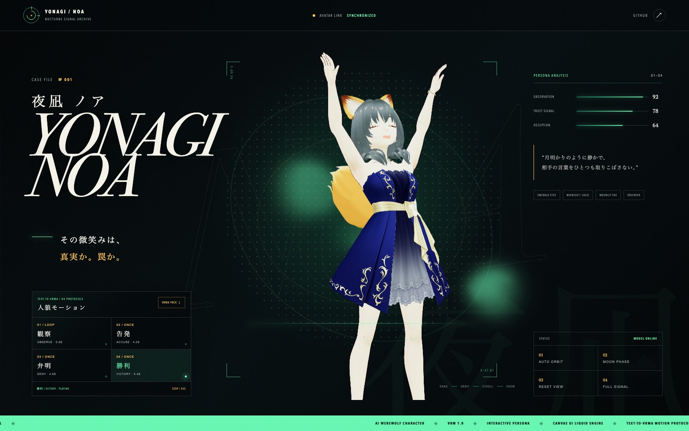

# 夜凪 ノア / Yonagi Noa

AI人狼キャラクター「夜凪 ノア」のVRMモデルと、WebGLによるインタラクティブ・プレビューです。

## Preview

**GitHub Pages:** https://sunwood-ai-labs.github.io/yonagi-noa-vrm/



「生きている尋問データベース」をコンセプトに、Canvas UIの流体エフェクトとVRMビューワーを融合しました。マウス・タッチでモデルを回転し、スクロールまたはピンチでズームできます。自動回転、月光ライティング、視点リセット、フルスクリーン表示に対応しています。

Text-To-VRMA v1.1.4で生成した、AI人狼向けの4モーションをサイト上で選択・再生できます。

- 観察 / OBSERVE — 相手の反応を静かに読むループモーション
- 告発 / ACCUSE — 前へ踏み込み、疑いを突きつける単発モーション
- 弁明 / DENY — 首を振り、両手で潔白を訴える単発モーション
- 勝利 / VICTORY — 一礼から月光を受ける決めポーズへ移る単発モーション

[4モーション一括ダウンロード](public/motions/yonagi-noa-motion-pack.zip)

## Local development

```bash
npm install
npm run dev
```

Production build:

```bash
npm run build
```

## Structure

- `public/models/yonagi-noa.vrm` — VRM 1.0 model
- `public/motions/*.vrma` — four VRM Animation 1.0 motion files
- `motions/specs/*.json` — Text-To-VRMA motion source specs
- `src/main.js` — Three.js / three-vrm viewer
- `src/canvasui/LiquidVanilla.ts` — Canvas UI Liquid fluid engine
- `src/style.css` — character archive visual design
- `.github/workflows/pages.yml` — GitHub Pages deployment

## Technology

- [Three.js](https://threejs.org/)
- [@pixiv/three-vrm](https://github.com/pixiv/three-vrm)
- [@pixiv/three-vrm-animation](https://github.com/pixiv/three-vrm)
- [Text-To-VRMA](https://github.com/Kirakun0328/text-to-vrma)
- [Canvas UI](https://canvasui.dev/)
- [Vite](https://vite.dev/)

Third-party notices are listed in [THIRD_PARTY_NOTICES.md](THIRD_PARTY_NOTICES.md).

## Asset rights

The character design and VRM model data are provided for viewing in this repository. No permission is granted to redistribute, sell, or reuse the model data outside this project without the owner's explicit approval.
