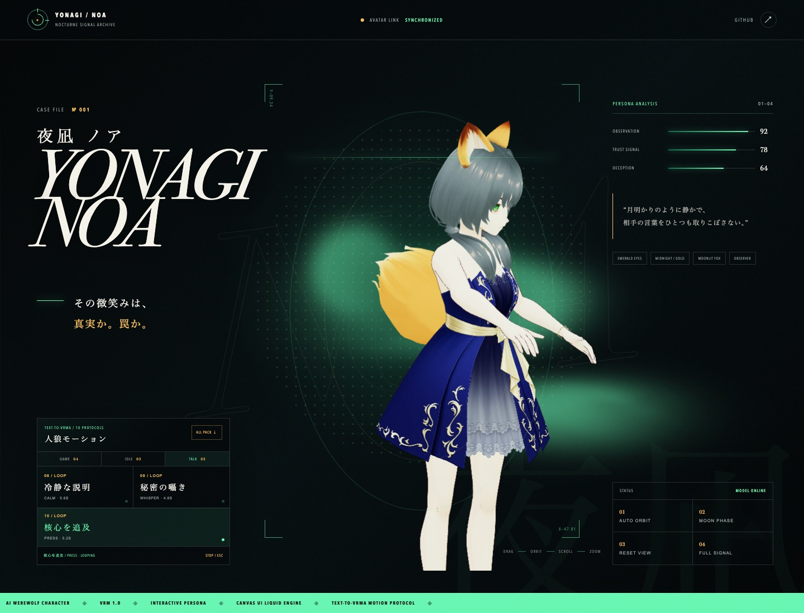
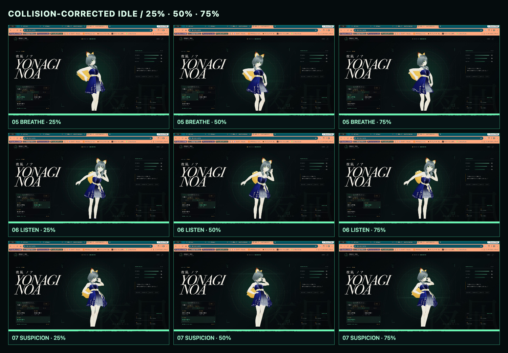
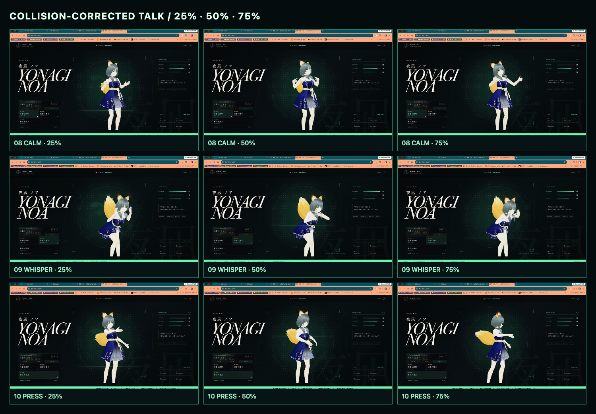

# 夜凪 ノア / Yonagi Noa

AI人狼キャラクター「夜凪 ノア」のVRMモデルと、WebGLによるインタラクティブ・プレビューです。

## Preview

**GitHub Pages:** https://sunwood-ai-labs.github.io/yonagi-noa-vrm/



「生きている尋問データベース」をコンセプトに、Canvas UIの流体エフェクトとVRMビューワーを融合しました。マウス・タッチでモデルを回転し、スクロールまたはピンチでズームできます。自動回転、月光ライティング、視点リセット、フルスクリーン表示に対応しています。

AI人狼向けの10モーションを、GAME / IDLE / TALKの3カテゴリから選択・再生できます。待機・トークの6本（05〜10）は、リモートRTX 4090上のText-To-VRMA v1.1.4からARDY-Core-RP-20FPS-Horizon40を実行して生成しました。各出力は20本の全身ボーントラックとhips位置トラックを持ちます。ARDY生JSONは不変の証跡として保存し、夜凪ノアの実VRM骨格に合わせた機械的な衝突補正を適用してから、同梱したText-To-VRMA v1.1.4のVRMA builderでVRMA 1.0へ変換しています。プロンプト・seed・生成設定・GPU証跡・生JSONは[`motions/ardy-v1.1.4`](motions/ardy-v1.1.4)に保存しています。

- 観察 / OBSERVE — 相手の反応を静かに読むループモーション
- 告発 / ACCUSE — 前へ踏み込み、疑いを突きつける単発モーション
- 弁明 / DENY — 首を振り、両手で潔白を訴える単発モーション
- 勝利 / VICTORY — 一礼から月光を受ける決めポーズへ移る単発モーション
- 静かな呼吸 / BREATHE — 呼吸しながら左右へ重心を移すARDY待機モーション
- 気配を聴く / LISTEN — 物音へ身体を向け、手を上げて周囲を探るARDY待機モーション
- 疑念を読む / SUSPICION — 片脚へ重心を預け、慎重に相手を読むARDY待機モーション
- 冷静な説明 / CALM — 両手を交互に使い、頷きながら説明するARDYトークモーション
- 秘密の囁き / WHISPER — 一歩寄り、口元へ手を添えて囁くARDYトークモーション
- 核心を追及 / PRESS — 前へ踏み込み、両手で矛盾を追及するARDYトークモーション

[10モーション一括ダウンロード](public/motions/yonagi-noa-motion-pack.zip)
／ [待機・トーク6モーション](public/motions/yonagi-noa-idle-talk-pack.zip)

## Motion visual QA

モーションはVRMA形式検証と数枚の再生スクリーンショットだけで完了にしません。
05〜10は全時間を40fpsで監査し、実VRM骨格へ合わせた胴体・衣装の楕円体コライダーと
上腕・前腕・手首・掌のサンプル半径で貫通を検出します。補正は肩・腕・手の回転だけへ
限定し、1軸38度以下、隣接フレーム間の補正差10度以下をゲートにしています。

ARDY生データでは1,434サンプル中1,343サンプルが3mmを超えるコライダー侵入として
検出されました。補正後は同じ1,434サンプルで0件です。この監査は再現可能な骨格ベースの
近似であり、衣装メッシュの全三角形を使う厳密な物理衝突ではありません。そのため数値監査に
加えて、25%・50%・75%と高リスク箇所の正面・斜め画像も確認しています。





- [衝突補正の数値監査と方式](artifacts/collision-audit)
- [秘密の囁き・斜め側面の監査](artifacts/collision-audit/visual/09-whisper-v6-oblique-front.png)
- [秘密の囁き・反対角度の監査](artifacts/collision-audit/visual/09-whisper-v6-oblique-opposite.png)
- [旧手作業版とのシルエット比較](artifacts/silhouette-audit/neutral-vs-six.jpg)

## Local development

```bash
npm install
npm run dev
```

Production build:

```bash
npm run build
```

## Structure

- `public/models/yonagi-noa.vrm` — VRM 1.0 model
- `public/motions/*.vrma` — ten VRM Animation 1.0 motion files
- `motions/ardy-v1.1.4/raw-specs/*.json` — unmodified ARDY responses
- `motions/specs/*.json` — collision-corrected motion specs used for the published VRMA files
- `scripts/motion-collision.mjs` — 40fps collision audit and mechanical correction
- `scripts/build-vrma.mjs` — deterministic VRMA rebuild
- `src/main.js` — Three.js / three-vrm viewer
- `src/canvasui/LiquidVanilla.ts` — Canvas UI Liquid fluid engine
- `src/style.css` — character archive visual design
- `.github/workflows/pages.yml` — GitHub Pages deployment

## Technology

- [Three.js](https://threejs.org/)
- [@pixiv/three-vrm](https://github.com/pixiv/three-vrm)
- [@pixiv/three-vrm-animation](https://github.com/pixiv/three-vrm)
- [Text-To-VRMA](https://github.com/Kirakun0328/text-to-vrma)
- [Canvas UI](https://canvasui.dev/)
- [Vite](https://vite.dev/)

Third-party notices are listed in [THIRD_PARTY_NOTICES.md](THIRD_PARTY_NOTICES.md).

## Asset rights

The character design and VRM model data are provided for viewing in this repository. No permission is granted to redistribute, sell, or reuse the model data outside this project without the owner's explicit approval.
