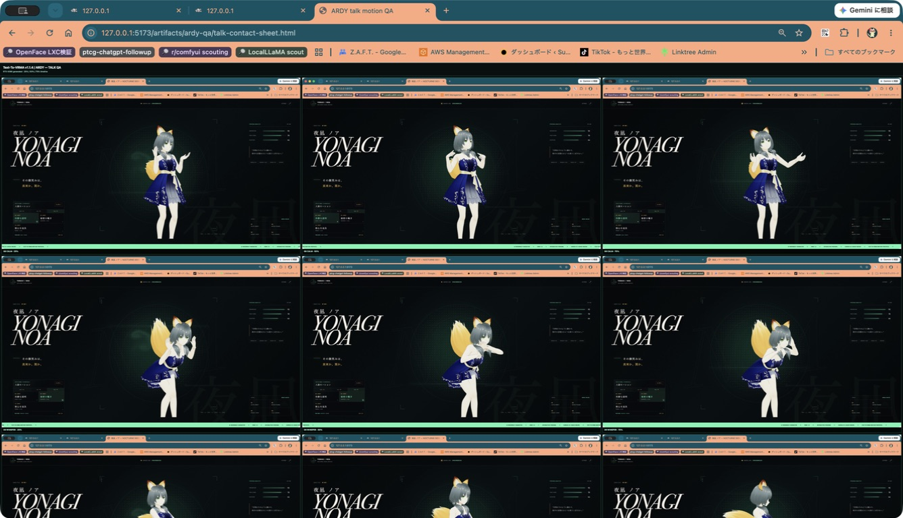

# 夜凪 ノア / Yonagi Noa

AI人狼キャラクター「夜凪 ノア」のVRMモデルと、WebGLによるインタラクティブ・プレビューです。

## Preview

**GitHub Pages:** https://sunwood-ai-labs.github.io/yonagi-noa-vrm/


「生きている尋問データベース」をコンセプトに、Canvas UIの流体エフェクトとVRMビューワーを融合しました。マウス・タッチでモデルを回転し、スクロールまたはピンチでズームできます。自動回転、月光ライティング、視点リセット、フルスクリーン表示に対応しています。

AI人狼向けの10モーションを、GAME / IDLE / TALKの3カテゴリから選択・再生できます。待機・トークの6本（05〜10）は、リモートRTX 4090上のText-To-VRMA v1.1.4からARDY-Core-RP-20FPS-Horizon40を実行して生成しました。各出力は20本の全身ボーントラックとhips位置トラックを持ち、ARDY生JSONを同梱の`spec2vrma.mjs`でVRMA 1.0へ変換しています。プロンプト・seed・生成設定・GPU証跡は[`motions/ardy-v1.1.4`](motions/ardy-v1.1.4)に保存しています。

- 観察 / OBSERVE — 相手の反応を静かに読むループモーション
- 告発 / ACCUSE — 前へ踏み込み、疑いを突きつける単発モーション
- 弁明 / DENY — 首を振り、両手で潔白を訴える単発モーション
- 勝利 / VICTORY — 一礼から月光を受ける決めポーズへ移る単発モーション
- 静かな呼吸 / BREATHE — 呼吸しながら左右へ重心を移すARDY待機モーション
- 気配を聴く / LISTEN — 物音へ身体を向け、手を上げて周囲を探るARDY待機モーション
- 疑念を読む / SUSPICION — 片脚へ重心を預け、慎重に相手を読むARDY待機モーション
- 冷静な説明 / CALM — 両手を交互に使い、頷きながら説明するARDYトークモーション
- 秘密の囁き / WHISPER — 一歩寄り、口元へ手を添えて囁くARDYトークモーション
- 核心を追及 / PRESS — 前へ踏み込み、両手で矛盾を追及するARDYトークモーション

[10モーション一括ダウンロード](public/motions/yonagi-noa-motion-pack.zip)
／ [待機・トーク6モーション](public/motions/yonagi-noa-idle-talk-pack.zip)

## Motion visual QA

モーションはVRMA形式検証と再生確認だけで完了にせず、各モーションを
25%・50%・75%の時点と正面・斜めから撮影しています。手首・前腕・胴体への
貫通や不自然な手の重なりに加え、ニュートラルとの差を比較しています。ただし、
05〜10はARDY生成後の生JSONとVRMAを対象に、ニュートラルとの差、脚の重心移動、
腕のシルエット、手と衣装の干渉を確認します。




- [秘密の囁き・正面の手元監査](artifacts/ardy-qa/09-talk-whisper-risk-front.png)
- [秘密の囁き・斜め後方の手元監査](artifacts/ardy-qa/09-talk-whisper-risk-oblique.png)
- [秘密の囁き・斜め前方の手元監査](artifacts/ardy-qa/09-talk-whisper-risk-oblique-opposite.png)
- [旧手作業版とのシルエット比較](artifacts/silhouette-audit/neutral-vs-six.jpg)

## Local development

```bash
npm install
npm run dev
```

Production build:

```bash
npm run build
```

## Structure

- `public/models/yonagi-noa.vrm` — VRM 1.0 model
- `public/motions/*.vrma` — ten VRM Animation 1.0 motion files
- `motions/specs/*.json` — Text-To-VRMA motion source specs
- `src/main.js` — Three.js / three-vrm viewer
- `src/canvasui/LiquidVanilla.ts` — Canvas UI Liquid fluid engine
- `src/style.css` — character archive visual design
- `.github/workflows/pages.yml` — GitHub Pages deployment

## Technology

- [Three.js](https://threejs.org/)
- [@pixiv/three-vrm](https://github.com/pixiv/three-vrm)
- [@pixiv/three-vrm-animation](https://github.com/pixiv/three-vrm)
- [Text-To-VRMA](https://github.com/Kirakun0328/text-to-vrma)
- [Canvas UI](https://canvasui.dev/)
- [Vite](https://vite.dev/)

Third-party notices are listed in [THIRD_PARTY_NOTICES.md](THIRD_PARTY_NOTICES.md).

## Asset rights

The character design and VRM model data are provided for viewing in this repository. No permission is granted to redistribute, sell, or reuse the model data outside this project without the owner's explicit approval.
