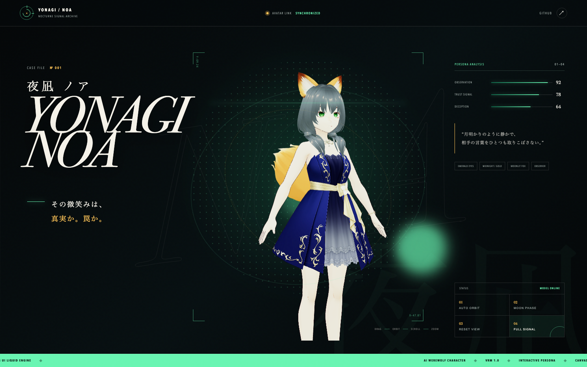

# 夜凪 ノア / Yonagi Noa

AI人狼キャラクター「夜凪 ノア」のVRMモデルと、WebGLによるインタラクティブ・プレビューです。

## Preview

**GitHub Pages:** https://sunwood-ai-labs.github.io/yonagi-noa-vrm/



「生きている尋問データベース」をコンセプトに、Canvas UIの流体エフェクトとVRMビューワーを融合しました。マウス・タッチでモデルを回転し、スクロールまたはピンチでズームできます。自動回転、月光ライティング、視点リセット、フルスクリーン表示に対応しています。

## Local development

```bash
npm install
npm run dev
```

Production build:

```bash
npm run build
```

## Structure

- `public/models/yonagi-noa.vrm` — VRM 1.0 model
- `src/main.js` — Three.js / three-vrm viewer
- `src/canvasui/LiquidVanilla.ts` — Canvas UI Liquid fluid engine
- `src/style.css` — character archive visual design
- `.github/workflows/pages.yml` — GitHub Pages deployment

## Technology

- [Three.js](https://threejs.org/)
- [@pixiv/three-vrm](https://github.com/pixiv/three-vrm)
- [Canvas UI](https://canvasui.dev/)
- [Vite](https://vite.dev/)

Third-party notices are listed in [THIRD_PARTY_NOTICES.md](THIRD_PARTY_NOTICES.md).

## Asset rights

The character design and VRM model data are provided for viewing in this repository. No permission is granted to redistribute, sell, or reuse the model data outside this project without the owner's explicit approval.
